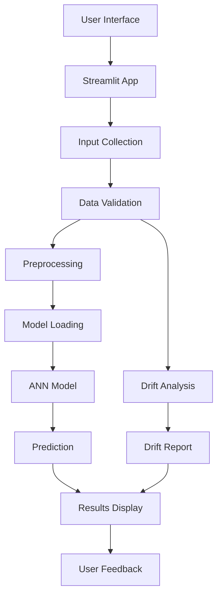

# 🌾 SafeGuard Ag: AI-Powered Crop Yield Prediction System

SafeGuard Ag is an intelligent Machine Learning and Deep Learning system designed to accurately predict crop yield based on environmental and agricultural factors.

The project integrates a complete AI pipeline including data preprocessing, exploratory data analysis (EDA), feature engineering, noise detection using XGBoost, feature scaling, and an Artificial Neural Network (ANN) built with TensorFlow/Keras.

The goal is to support precision agriculture by providing reliable crop yield predictions that assist farmers and decision-makers in maximizing productivity and optimizing agricultural resources.

---

## 🏗️ Project Structure

```text
SafeGuard-Ag/
├── 📂 data/
│   └── crop_yield.csv                    # Agricultural dataset (10,000+ rows)
│
├── 📂 models/                            # 🧠 Trained artifacts
│   ├── crop_encoder.pkl                  # Crop label encoder
│   ├── region_encoder.pkl                # Region label encoder
│   ├── soil_encoder.pkl                  # Soil type encoder
│   ├── weather_encoder.pkl               # Weather condition encoder
│   ├── scaler.pkl                        # StandardScaler
│   └── crop_yield_ann.keras              # Trained ANN model
│
├── 📂 notebooks/                         # 📓 Jupyter notebooks
│   └── Crop_Yield_Prediction.ipynb       # Main training pipeline
|
├── 📂 .streamlit/                      
│   └── config.toml       
│
├── 📂 venv/                              # 🐍 Python environment
│
├── .gitignore
├── packages.txt
├── runtime.txt
├── Dockerfile
├── drift_analysis.py
├── app.py                                # 🚀 Flask application
├── README.md
└── requirements.txt                      # 📦 Dependencies
```
---
## 📌 Key Features

- ✅ **Data Preprocessing** – Handling missing values, outliers, and duplicates.
- ✅ **Exploratory Data Analysis (EDA)** – Statistical analysis, correlation matrices, and rich visualizations.
- ✅ **Feature Engineering** – Encoding categorical variables and scaling numerical features.
- ✅ **Noise Detection** – Using XGBoost to detect and remove noisy data points (top 10% residuals).
- ✅ **Deep Learning Model** – Artificial Neural Network (ANN) with:
  - 3 Dense layers (128, 64, 32 neurons)
  - Batch Normalization & Dropout for regularization
  - Adam optimizer with learning rate scheduling
- ✅ **Model Evaluation** – R² Score, RMSE, MAE, and stability analysis across multiple runs.
- ✅ Model Persistence – Save trained models, encoders, and scaler using joblib and keras.
- ✅ Streamlit Web Application – Interactive and user-friendly interface for real-time predictions.
- ✅ Data Drift Detection – Real-time monitoring of input data quality using statistical analysis.
- ✅ Modern UI/UX – Responsive design with smooth animations, gradient aesthetics, and bolder visual elements.
- ✅ Docker Support – Containerized deployment for consistent environments.

---

## 🛠️ Tech Stack

### **Data Science & Machine Learning**
| Tool/Library | Version | Purpose |
|--------------|---------|---------|
| **Python** | 3.10+ | Core programming language |
| **Pandas** | 2.0.3 | Data manipulation & analysis |
| **NumPy** | 1.24.3 | Numerical computations |
| **Scikit-learn** | 1.3.0 | Preprocessing, encoders, metrics |
| **TensorFlow/Keras** | 2.13.0 | Deep learning model (ANN) |
| **XGBoost** | 1.7.6 | Noise detection & feature importance |
| **Matplotlib** | 3.7.2 | Data visualization |
| **Seaborn** | 0.12.2 | Statistical visualizations |
| **Joblib** | 1.3.1 | Model serialization |

### **Web Development & Deployment**
| Tool/Library | Version | Purpose |
|--------------|---------|---------|
| **Streamlit** | 2.3.2 | Interactive Web framework |
| **Google Fonts** | - | Typography (Google Sans) |
| **Docker** | - | Containerization |

---

## 📊 Model Performance

The ANN model achieved the following evaluation metrics after rigorous training and noise cleaning:

| Metric | Value |
|--------|-------|
| **R² Score** | 0.9427 |
| **RMSE** | 0.4001 tons/ha |
| **MAE** | 0.3323 tons/ha |
| **Residual Std** | 0.3999 |

### Stability Analysis (5 Runs)
  
| Metric | Mean | Std |
|--------|------|-----|
| **R²** | 0.941727 | 0.001041 |
| **RMSE** | 0.402539 | 0.003557 |
| **MAE** | 0.33408 | 0.00240 |

The model demonstrates **high stability** and **consistency** across multiple training runs.

---

## ⚙️ Prerequisites

Before running the project, ensure the following software is installed:

- Python 3.10+
- Jupyter Notebook
- Git

---

## 🚀 Getting Started & Installation

### 1️⃣ Clone the Repository

```bash
git clone https://github.com/eng-Shahd-Mostafa/DEPI-Project.git

cd DEPI-Project
```

---

### 2️⃣ Create a Virtual Environment (Recommended)

Using Conda:

```bash
conda create -n DEPI-Project python=3.10 -y

conda activate DEPI-Project
```

Or using venv:

```bash
python -m venv venv

# Windows
venv\Scripts\activate

# Linux / macOS
source venv/bin/activate
```

---

## 👥 **Team & Contributors**

<div align="center">

### 🎯 **Project Lead & AI Engineer**

<table align="center"> <tr> <td align="center">  <br /> <strong>Shahd Mostafa</strong> <br /> 🎓 AI & ML Engineer <br /> 🔬 Deep Learning Specialist <br /> <br /> <a href="https://github.com/eng-Shahd-Mostafa">  </a> <a href="https://www.linkedin.com/in/engshahdmostafa/">  </a> <a href="mailto:eng.shahd.mostafa@gmail.com">  </a> </td> </tr> </table>

---

## 🚀 **Deployment & Implementation**

### **🌐 Live Demo**

<div align="center">

| Platform | Status | Link |
|----------|--------|------|
| **Local Server** | 🟢 Active | `http://127.0.0.1:5000` |
| **Live Server** | 🟢 Public | [SafeGuard Link](https://huggingface.co/spaces/EngShahdMostafa/SafeGuard_Agriculture) |
| **GitHub Repository** | 🟢 Public | [View Repository](https://github.com/eng-Shahd-Mostafa/DEPI-Project) |
| **Documentation** | 🟢 Complete | [README.md](README.md) |

</div>

---

### **📊 Deployment Architecture**


---
<div align="center">
<br />
<h5 style="background: linear-gradient(135deg, #667eea 0%, #764ba2 50%, #f093fb 100%); -webkit-background-clip: text; -webkit-text-fill-color: transparent; font-size: 30px; font-weight: 500; margin: 10px 0;">
  Made with ❤️ Shahd Mostafa
</h5>
<br />
</div>