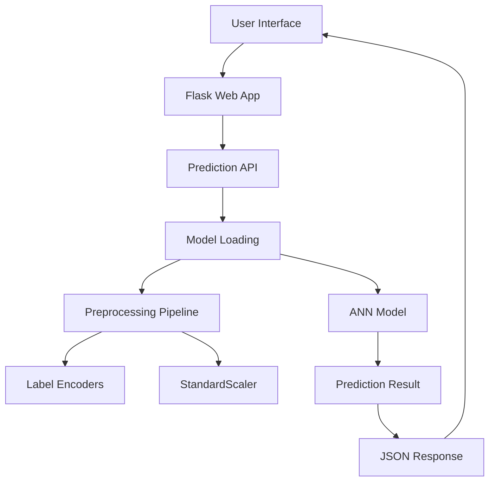

# 🌾 SafeGuard Ag: AI-Powered Crop Yield Prediction System

SafeGuard Ag is an intelligent Machine Learning and Deep Learning system designed to accurately predict crop yield based on environmental and agricultural factors.

The project integrates a complete AI pipeline including data preprocessing, exploratory data analysis (EDA), feature engineering, noise detection using XGBoost, feature scaling, and an Artificial Neural Network (ANN) built with TensorFlow/Keras.

The goal is to support precision agriculture by providing reliable crop yield predictions that assist farmers and decision-makers in maximizing productivity and optimizing agricultural resources.

---

## 🏗️ Project Structure

```text
SafeGuard-Ag/
├── 📂 data/
│   └── crop_yield.csv                    # Agricultural dataset (10,000+ rows)
│
├── 📂 graphs/                            # 📊 Generated visualizations
│   ├── plot_01_yield_distribution.png    # Yield distribution analysis
│   ├── plot_02_yield_by_crop.png         # Yield by crop type
│   ├── plot_03_yield_by_region.png       # Yield by region
│   ├── plot_04_correlation_matrix.png    # Feature correlation
│   └── plot_05_feature_importance.png    # Feature importance
│   └── ...
│
├── 📂 models/                            # 🧠 Trained artifacts
│   ├── crop_encoder.pkl                  # Crop label encoder
│   ├── region_encoder.pkl                # Region label encoder
│   ├── soil_encoder.pkl                  # Soil type encoder
│   ├── weather_encoder.pkl               # Weather condition encoder
│   ├── scaler.pkl                        # StandardScaler
│   └── crop_yield_ann.keras              # Trained ANN model
│
├── 📂 notebooks/                         # 📓 Jupyter notebooks
│   └── Crop_Yield_Prediction.ipynb       # Main training pipeline
│
├── 📂 static/                            # 🎨 Web assets
│   ├── style.css                         # Custom styling
│   └── script.js                         # Frontend interactivity
│
├── 📂 templates/                         # 📄 HTML templates
│   └── index.html                        # Main web interface
│
├── 📂 venv/                              # 🐍 Python environment
│
├── .gitignore
├── app.py                                # 🚀 Flask application
├── README.md
└── requirements.txt                      # 📦 Dependencies
```
---
## 📌 Key Features

- ✅ **Data Preprocessing** – Handling missing values, outliers, and duplicates.
- ✅ **Exploratory Data Analysis (EDA)** – Statistical analysis, correlation matrices, and rich visualizations.
- ✅ **Feature Engineering** – Encoding categorical variables and scaling numerical features.
- ✅ **Noise Detection** – Using XGBoost to detect and remove noisy data points (top 10% residuals).
- ✅ **Deep Learning Model** – Artificial Neural Network (ANN) with:
  - 3 Dense layers (128, 64, 32 neurons)
  - Batch Normalization & Dropout for regularization
  - Adam optimizer with learning rate scheduling
- ✅ **Model Evaluation** – R² Score, RMSE, MAE, and stability analysis across multiple runs.
- ✅ **Model Persistence** – Save trained models, encoders, and scaler using `joblib` and `keras`.
- ✅ **Flask Web Application** – User-friendly interface for real-time predictions.
- ✅ **Modern UI/UX** – Responsive design with smooth animations and gradient aesthetics.

---

## 🎯 Milestones

### Milestone 1: Data Collection, Exploration, and Preprocessing

- Load agricultural dataset.
- Handle missing values.
- Remove duplicates.
- Detect outliers.
- Encode categorical variables.
- Normalize numerical features.

### Milestone 2: Exploratory Data Analysis

- Select and fine-tune a model: FaceNet, VGG-Face, DeepFace, or custom CNN.
- Statistical Analysis.
- Distribution Analysis.
- Correlation Matrix.
- Feature Importance.
- Data Visualization.

### Milestone 3: Model Development & Evaluation

- Deploy the model via Flask API.
- Feature Engineering.
- XGBoost Noise Detection.
- Train/Test Split.
- Feature Scaling.
- ANN Development.
- MAE, RMSE, R² Score, Error Analysis

### Milestone 4: Deployment & Future Improvements

- Model Saving.
- Prediction Pipeline.
- Explainable AI.
- Dashboard Integration.

### Milestone 5: Final Documentation and Presentation

- Full project report covering data, model, deployment, and monitoring.
- Presentation of system architecture and real-world impact.

---
## 🛠️ Tech Stack

### **Data Science & Machine Learning**
| Tool/Library | Version | Purpose |
|--------------|---------|---------|
| **Python** | 3.10+ | Core programming language |
| **Pandas** | 2.0.3 | Data manipulation & analysis |
| **NumPy** | 1.24.3 | Numerical computations |
| **Scikit-learn** | 1.3.0 | Preprocessing, encoders, metrics |
| **TensorFlow/Keras** | 2.13.0 | Deep learning model (ANN) |
| **XGBoost** | 1.7.6 | Noise detection & feature importance |
| **Matplotlib** | 3.7.2 | Data visualization |
| **Seaborn** | 0.12.2 | Statistical visualizations |
| **Joblib** | 1.3.1 | Model serialization |

### **Web Development & Deployment**
| Tool/Library | Version | Purpose |
|--------------|---------|---------|
| **Flask** | 2.3.2 | Web framework |
| **HTML5/CSS3** | - | Frontend structure & styling |
| **JavaScript** | - | Client-side interactivity |
| **Google Fonts** | - | Typography (Inter & Tajawal) |

---

## 📊 Model Performance

The ANN model achieved the following evaluation metrics after rigorous training and noise cleaning:

| Metric | Value |
|--------|-------|
| **R² Score** | 0.9426 |
| **RMSE** | 0.4001 tons/ha |
| **MAE** | 0.3323 tons/ha |
| **Residual Std** | 0.3999 |

### Stability Analysis (5 Runs)
| Metric | Mean | Std |
|--------|------|-----|
| **R²** | 0.941727 | 0.001041 |
| **RMSE** | 0.402539 | 0.003557 |
| **MAE** | 0.33408 | 0.00240 |

The model demonstrates **high stability** and **consistency** across multiple training runs.

---

## 📈 Data Preprocessing Pipeline

### 1. **Data Cleaning**
- Removed negative yield values
- Detected and handled outliers using IQR method
- Removed top 10% noisy data points using XGBoost residual analysis

### 2. **Feature Engineering**
- Encoded categorical features:
  - `Region`
  - `Soil_Type`
  - `Crop`
  - `Weather_Condition`
- Converted boolean features to integers:
  - `Fertilizer_Used`
  - `Irrigation_Used`
- Standardized numerical features using `StandardScaler`

### 3. **Train/Test Split**
- 80% training, 20% testing
- Random state: 42 for reproducibility

---
## 🧠 Model Architecture

```python
Model: "sequential"
_________________________________________________________________
Layer (type)                 Output Shape              Param #
=================================================================
dense (Dense)                (None, 128)               1280
batch_normalization (BN)     (None, 128)               512
dropout (Dropout)            (None, 128)               0
dense_1 (Dense)              (None, 64)                8256
batch_normalization_1 (BN)   (None, 64)                256
dropout_1 (Dropout)          (None, 64)                0
dense_2 (Dense)              (None, 32)                2080
batch_normalization_2 (BN)   (None, 32)                128
dense_3 (Dense)              (None, 1)                 33
=================================================================
Total params: 12,545
Trainable params: 12,097
Non-trainable params: 448
_________________________________________________________________
```
---

## ⚙️ Prerequisites

Before running the project, ensure the following software is installed:

- Python 3.10+
- Jupyter Notebook
- Anaconda (Optional)
- Git

---

## 🚀 Getting Started & Installation

### 1️⃣ Clone the Repository

```bash
git clone https://github.com/eng-Shahd-Mostafa/DEPI-Project.git

cd DEPI-Project
```

---

### 2️⃣ Create a Virtual Environment (Recommended)

Using Conda:

```bash
conda create -n DEPI-Project python=3.10 -y

conda activate DEPI-Project
```

Or using venv:

```bash
python -m venv venv

# Windows
venv\Scripts\activate

# Linux / macOS
source venv/bin/activate
```

---

## 👥 **Team & Contributors**

<div align="center">

### 🎯 **Project Lead & AI Engineer**

<table align="center">
<tr>
<td align="center">

<br />
<strong>Shahd Mostafa</strong>
<br />
🎓 AI & ML Engineer
<br />
🔬 Deep Learning Specialist
<br />
<br />
<a href="https://github.com/eng-Shahd-Mostafa">
  
</a>
<a href="https://www.linkedin.com/in/engshahdmostafa/">
  
</a>
<a href="mailto:eng.shahd.mostafa@gmail.com">
  
</a>
</td>
</tr>
</table>

---

### 🏆 **Project Supervisors & Mentors**

<table>
<tr>
<td align="center">
<strong>🎓 DEPI Program</strong><br />
Digital Egypt Pioneers Initiative<br />
<em>AI & Machine Learning Track</em>
</td>
<td align="center">
<strong>👨‍🏫 Technical Mentors</strong><br />
Expert Guidance & Support<br />
<em>Industry Professionals</em>
</td>
</tr>
</table>

</div>

---

## 🚀 **Deployment & Implementation**

### **🌐 Live Demo**

<div align="center">

| Platform | Status | Link |
|----------|--------|------|
| **Local Server** | 🟢 Active | `http://127.0.0.1:5000` |
| **GitHub Repository** | 🟢 Public | [View Repository](https://github.com/eng-Shahd-Mostafa/DEPI-Project) |
| **Documentation** | 🟢 Complete | [README.md](README.md) |

</div>

---

### **📊 Deployment Architecture**


---
## 📚 **References & Research**

<div align="center">

### 🔗 **Useful Resources**

| Resource | Link | Purpose |
|----------|------|---------|
| **TensorFlow** | [tensorflow.org](https://www.tensorflow.org) | Deep Learning Framework |
| **Scikit-learn** | [scikit-learn.org](https://scikit-learn.org) | Machine Learning Library |
| **Flask** | [flask.palletsprojects.com](https://flask.palletsprojects.com) | Web Framework |
| **XGBoost** | [xgboost.readthedocs.io](https://xgboost.readthedocs.io) | Gradient Boosting |

</div>

<div align="center">
  
<br />
  
<h5 style="background: linear-gradient(135deg, #667eea 0%, #764ba2 50%, #f093fb 100%); -webkit-background-clip: text; -webkit-text-fill-color: transparent; font-size: 30px; font-weight: 500; margin: 10px 0;">
  Made with ❤️ Shahd Mostafa
</h5>

<br />

</div>
